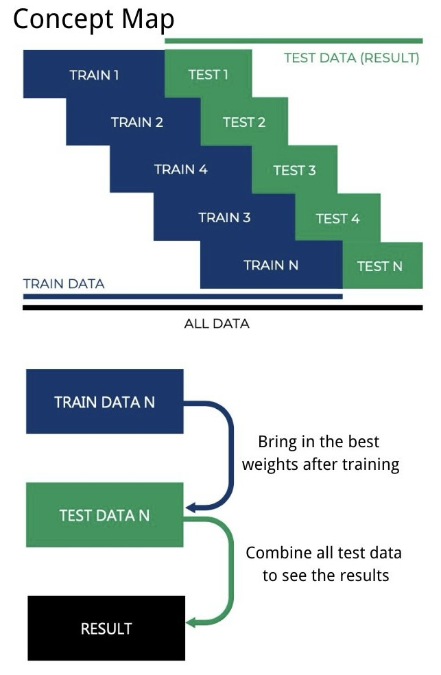
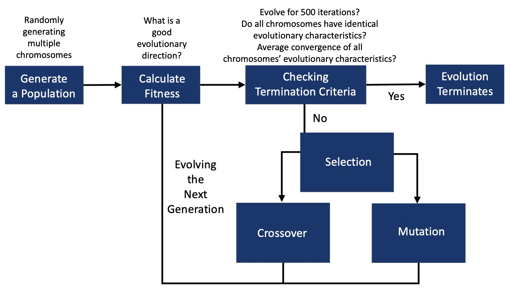
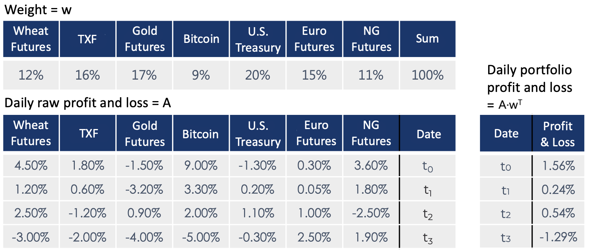
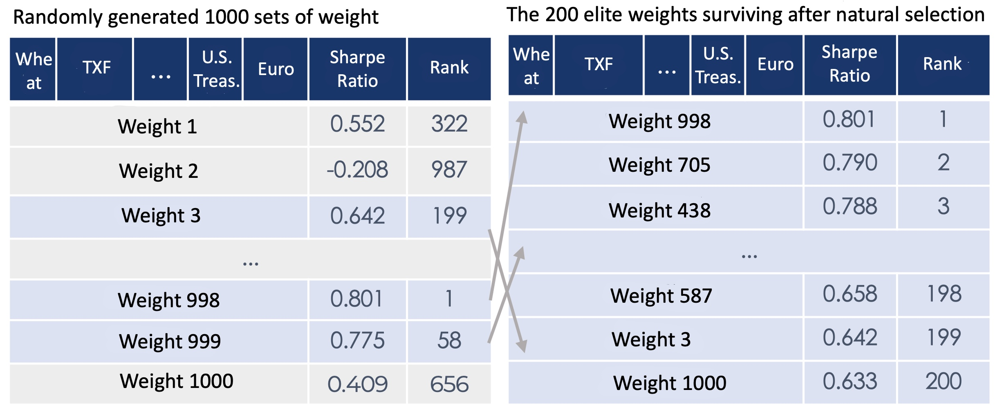
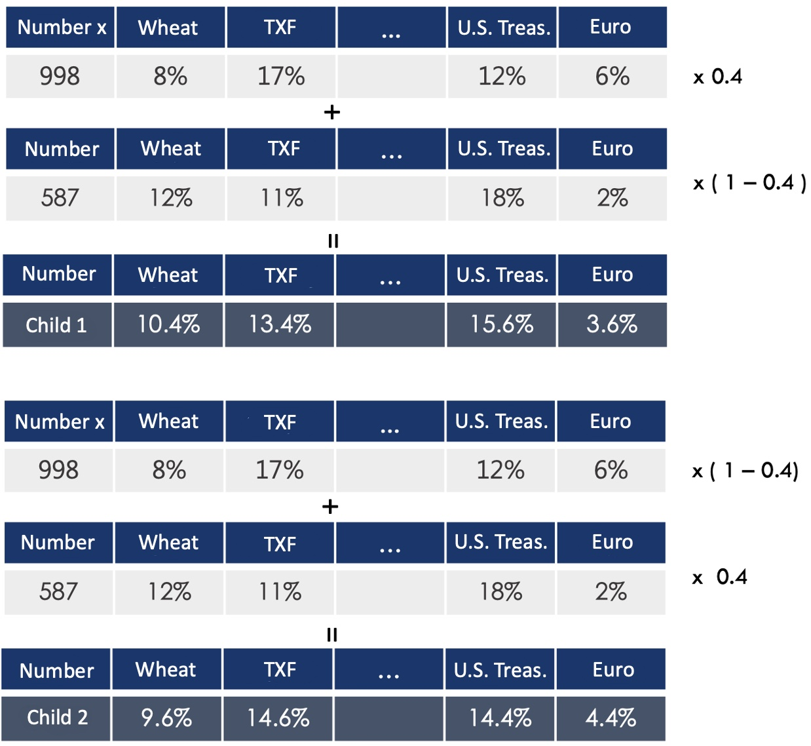
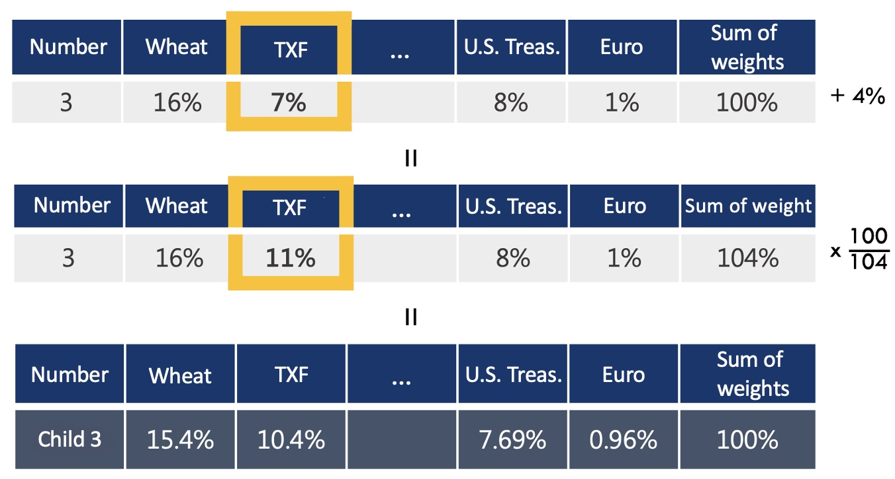
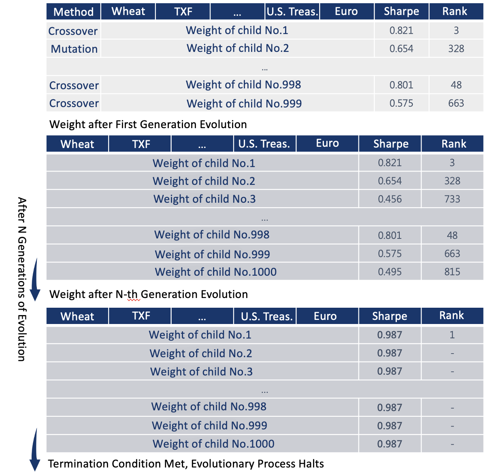

# Genetic Algorithms Optimize Asset Allocation
# Introduction

Asset Allocation and Portfolio have been very popular topics for many years. Investors can obtain excess returns and diversify their investments by investing in different financial products.
risk. However, how to select high-return, low-risk investment portfolios from the market is really difficult.
knowledge.

As we all know, when investing in financial products, high returns come with high risks. Nobel Prize Winner in Economics
Markowitz proposed the concept of investment portfolio in 1952, using the metaphor of "eggs should not be put in the same basket" to illustrate the importance of risk diversification; using diversification to reduce the risk of investing in commodities, it is expected to achieve the lowest risk effect. . Among them, expected return is often defined as the simple average of daily profits and losses in the past period; risk, also known as volatility, is often defined as the standard deviation of daily profits and losses in the past period. The larger the standard deviation, the greater the standard deviation of the asset in the past. The greater the fluctuation, the greater the risk.

By allocating assets with low correlations in a portfolio, you can effectively diversify volatility. During significant downside risks, unlike single assets, other positions in the portfolio may have bullish trends, thereby hedging the losses. This is equivalent to installing shock absorbers for your investment. A portfolio with relatively small losses will tend to have a stable profit and loss curve, which is beneficial for investors to use leverage.

Since the portfolio is a weighted result, its cumulative return will lie between the upper and lower bounds of the cumulative returns of the individual assets within the portfolio. However, with effective risk diversification, the volatility from leverage will be at a similar level to investing in a single asset without risk diversification, while still enjoying multiple times the excess returns.

Whether obtaining higher returns with the same risk or significantly reducing risk with the same returns, portfolio management is greatly favored by investors. However, creating an optimal portfolio poses a significant challenge for average investors with limited computational power and financial knowledge—they cannot guarantee the quality of their investment portfolios. Therefore, this research aims to solve this issue through the use of genetic algorithms.

# Related Research

In many quantitative trading hedge funds and trading rooms, mathematical statistics and programming are widely used to solve trading problems. Asset allocation is an important area of research within this scope.

Although this study did not reference other papers during its execution, we examined related topics after completing the research. We found that similar algorithms or machine learning attempts have been used in asset allocation in academic studies. For example, Fan-Chun Meng (2019) utilized DDPG and PPO deep reinforcement learning algorithms, Shang-Ren Lin (2020) used PPO deep reinforcement learning algorithms, and Zihao Zhang, Stefan Zohren, and Stephen Roberts (2020 FALL) employed deep learning in the Journal of Financial Data Science.

Regarding research outcomes, we discovered that while the deep learning methods used by Zihao Zhang, Stefan Zohren, and Stephen Roberts yielded good results in their papers, the backtesting instruments used, such as the non-tradable VIX index (fear index), have limitations. We believe that the accuracy and stability of such backtesting results for non-tradable market instruments require further scrutiny.

Therefore, before commencing this study, we decided to seek historical data of tradable instruments for backtesting. Regardless of the research outcomes, this approach ensures that our research methodology has at least a practical basis for evaluation.

# Methodology

__(1) Analytical Methods__

Genetic Algorithm (GA) draws inspiration from evolutionary biology phenomena such as inheritance, selection, mutation, and crossover. GA excels at solving global optimization problems and is often used to tackle practical engineering issues like logistics management, production scheduling, and computer-aided design. Compared to traditional optimization algorithms, one of GA's strengths is its ability to escape local optima and find global optima. Moreover, GA allows the use of highly complex fitness functions (or objective functions) and can impose restrictions on variable ranges. In contrast, traditional optimization algorithms may encounter significantly more complex processes when dealing with variable range constraints.


Due to its high flexibility and wide applicability, we aim to apply GA's characteristics to the financial domain to construct an optimized asset portfolio.

__(2) Performance Indicators__

To select the optimal investment portfolio, it is essential first to define the performance metrics. This study prioritizes the "Sharpe Ratio" as the primary indicator, optimizing for it as the evolutionary direction. Simultaneously, "Maximum Drawdown," "Average Drawdown," and "Risk-Reward Ratio" will also be used as references to measure the quality of the investment portfolio.

__What is the Sharpe Ratio?__

When investors choose investment targets, they typically first observe the historical cumulative returns of the asset. However, high-return assets with significant volatility, or those that oscillate for most of the investment period and only increase in the last year, like Taiwan shipping stocks post-pandemic, do not make for good investment portfolios. Investors might face substantial losses or incur time costs without seeing results, leading to a loss of confidence and withdrawal of funds, missing out on potential gains. Therefore, for an investment portfolio, seeking low risk volatility with stable growth is a better indicator than mere cumulative returns. Academics and practitioners often use the "Sharpe Ratio" to measure the risk and return of an asset or investment portfolio. The formula for Sharpe Ratio is: $$Sharpe Ratio = \frac{(Expected Return - Risk-free Interest)}{Risk Rate}$$ This is defined as the expected value of the investment return relative to the risk-free return, divided by the standard deviation (volatility) of the investment, indicating the extra return per unit of risk taken.

__Drawdown__

Besides the Sharpe Ratio, Drawdown is also a commonly used metric in practical investment trading. It is defined as the decline from the highest point of the return curve at any given time, essentially the loss relative to the highest value that could have been realized but wasn't. For example, if a stock is bought at $50 and reaches a new high of $100 by the previous day's close but is not sold, and drops to $98 by today's close, the $2 loss is the drawdown. Maximum Drawdown, Average Drawdown, and the Risk-Reward Ratio (cumulative return divided by the maximum drawdown) are frequently used performance metrics in practical trading. A large drawdown can cause traders to lose confidence and withdraw their positions, representing another form of risk.

__(3) Analyze Goals__

Our research focuses on multiple assets with weight adjustments at regular intervals, such as quarterly, annually, or other specified periods. The goal is to create a portfolio with the best Sharpe ratio and compare it to benchmarks (average allocation, random allocation). This study aims to maximize the Sharpe ratio, and ultimately, the selected portfolios of each team member will be presented.
The data for the entire period is sourced from Yahoo Finance, covering the period from January 1, 2005, to January 1, 2022. The assets are as follows (Yahoo Finance ticker symbols in parentheses):

Cocoa Futures (CC=F)<br>
NASDAQ Futures (NQ=F)<br>
0050 ETF (0050.TW)<br>
TSMC Stock (2330.TW)<br>
Gold Futures (GC=F)<br>
U.S. Treasury Futures (ZB=F)<br>

__Crawler Function Implementation Code__

The YahooData function is used to fetch the closing price data for a given date range and stock or futures ticker symbol. The Generate_Data function takes a list of stock ticker symbols as input and consolidates all closing prices into a single DataFrame.

```python
def YahooData(ticker, start, end):
  headers = {
    'User-Agent': 'Mozilla/5.0 (Macintosh; Intel Mac OS X 10_11_2) AppleWebKit/601.3.9 (KHTML, like Gecko) Version/9.0.2 Safari/601.3.9'
  }

  url = "https://query1.finance.yahoo.com/v7/finance/download/" + str(ticker)
  x = int(datetime.strptime(start, '%Y-%m-%d').timestamp())
  y = int(datetime.strptime(end, '%Y-%m-%d').timestamp())
  url += "?period1=" + str(x) + "&period2=" + str(y) + "&interval=1d&events=history&includeAdjustedClose=true"

  r = requests.get(url, headers=headers)
  pad = pd.read_csv(io.StringIO(r.text), index_col=0, parse_dates=True)
  return pad['Close'].pct_change()


def generate_data(t_list, start_day, end_day):
  print('start loading')
  df = pd.DataFrame()
  for ticker in t_list:
    temp_stock = YahooData(ticker, start_day, end_day)
    print(ticker, 'loaded')
    df = pd.concat([df, temp_stock], axis=1)
  print('loading finish')
  df.columns = t_list
  df = df.fillna(0)
  return df
```

__(4)Analysis Architecture__

We split the entire dataset into several training and testing datasets, updating them at fixed intervals. (The analysis method will be explained in the implementation process later.) The weights trained on the training data are then applied to the corresponding testing data to observe the portfolio's performance. This approach achieves practical trading effects, avoiding overfitting or foresight issues.



__(5)Algorithm: Genetic Algorithm__



# Concept Introduction

__(1) Summary__

The method used to train the weights in the training data is the Genetic Algorithm (GA), which is an optimization algorithm inspired by the process of natural selection. Essentially, it simulates the evolutionary process of survival of the fittest. Initially, a population is generated, and before reaching the termination condition, a selection of elite individuals is made. These elites then produce the next generation through crossover or mutation, continuing the evolution process until termination.

__(2) Generating Population/Chromosomes and Genes__

We first generate a population, which consists of various chromosomes. Each chromosome contains different genes. We can think of a chromosome as the variable 𝑥 in a function 𝑓(𝑥), and a gene as an individual element 𝑥𝑖 within the 𝑥 vector. From an evolutionary algorithm perspective, a chromosome can represent an individual organism, while in the context of portfolio optimization, a chromosome can represent a set of weights.

__Fitness Function__<br>
Next, we use the fitness function to calculate the fitness value of each chromosome. Depending on different applications, we can design various calculation methods. The concept is similar to the function 𝑓(𝑥) in mathematics, where 𝑓 represents the fitness function. In evolutionary terms, among many giraffes, the shorter ones cannot reach the leaves and thus die out, leaving only the taller giraffes. In this case, height is their fitness value. Applied to portfolio or trading, our goal is to discard poor weights and keep the good ones. The fitness value could be the Sharpe ratio, cumulative return, maximum drawdown, etc., depending on our desired evolutionary direction. In this study, we use the Sharpe ratio as the fitness value.

__Elite Selection__<br>
After calculating the fitness of the generated population, if the termination condition is not yet met, we proceed to "selection". The purpose of this step is to retain the good and eliminate the bad. Implementation methods include the roulette wheel method, elitism, etc. In this study, we use the elitism method, which selects the weights with the highest Sharpe ratios in the population as the "elite". After selecting the elite, we move on to the crossover or mutation stage, where the evolutionary process is determined by preset probabilities.

__Crossover__<br>
Crossover is akin to "like begets like"; the new chromosomes inherit favorable genes from their parent chromosomes, leading to directional evolution without introducing new information. In the biological world, this means that the surviving tall giraffes mate and produce offspring with genes for tall height, resulting in tall young giraffes.

__Mutation__<br>
Mutation is intended to avoid the evolution falling into local optima and to allow the evolution to move towards global optima. It randomly selects a gene in a chromosome to mutate, introducing new information not seen before, resulting in non-directional evolution. In the context of a mutation, a giraffe might turn into a unicorn, representing a surprising change that helps escape local optima.

# Implementation Process

__(1) Generating Chromosomes to Form the Initial Population__

In one evolutionary cycle, we randomly generate n sets of weights using a chromosome-generating function (i.e., a function that generates random weights). The number n can be any number specified by the user, but if the population is too small, it might not fully leverage the advantages of the Genetic Algorithm and may easily fall into local optima. Conversely, if the population is too large, the computation time will be excessively long. We generate 1000 sets of weights as the total number of one generation's population.

__Implementation Code for Generating a Single Chromosome (Weight)__

Randomly generate n sets of numbers and adjust them to weights that sum up to one based on the ratio of each single value to the total sum. Set upper and lower bounds, and if any gene exceeds the range, regenerate the chromosome (weight).

```python
# Randomly generate chromosomes (weights), reselect if out of bounds
def chromosome(n, lb, ub):
  while True:
    ch = np.random.rand(n)
    result = np.array(ch/sum(ch))
    all_asset_st = (lb <= result) & (result <= ub)
    if all_asset_st.all():
      return result
    else:
      continue
```

__Implementation Code for Generating the Initial Population__

Below is the overall function for the Genetic Algorithm. The Population variable at line 144 is the code that generates the initial population.

```python
def GA_optimize(df, Population_size, rate, iter_bound):
  number = len(df.columns)
  Population = np.array([chromosome(number, LowerBound, UpperBound) for _ in range(Population_size)])
  Elite_population = select_elite(df, Population, rate)
  iteration = 0
  while iteration <= iter_bound:
    Population = next_generation(Population_size, Elite_population)
    Elite_population = select_elite(df, Population, rate)
    iteration += 1
  result = max(Elite_population, key=lambda x: sharpe_ratio(df, x))
  return result
```

__(2)Fitness Function__

After generating the population, we need to individually calculate the fitness value for each chromosome. In asset allocation, chromosomes represent the weights, and for each training dataset, we can use the aforementioned method to calculate the desired fitness value—the Sharpe ratio.



__Expected Return__<br>
Defined as the simple average of portfolio returns over the period 𝑡0-𝑡𝑛 (in the example, 𝑡0-𝑡3). The expected return in the example is calculated as 0.26%.

__Risk__<br>
Defined as the standard deviation of portfolio returns over the period 𝑡0-𝑡𝑛 (in the example, 𝑡0-𝑡3). The risk in the example is calculated as 1.18%.

__Risk-Free Interest Rate__<br>
Defined as the theoretical return from a risk-free investment, which is required for Sharpe ratio calculations. In practice, it is typically represented by government bond yields. In the example, it is set at 0.05%.

__Sharpe Ratio__<br>
The fitness function used to evaluate the fitness value of chromosomes is defined as the Sharpe Ratio, which simultaneously measures both risk and return. It is calculated using the formula:

Sharpe Ratio
= (Expected Return − Risk-Free Interest Rate)/Risk
 
Using the example data, the Sharpe Ratio is calculated as:
Sharpe Ratio = (0.26% - 0.05%) / 0.18% = 0.1779。

__Implementation Code for the Fitness Function__<br>
Each weight can correspond to a Sharpe ratio. Using jit compilation from numba can speed up the computation of the Sharpe ratio for each weight.

```python
@jit 
def pnl(df, w): 
  return (df * w).sum(axis=1) 
  
@jit 
def ret(array): 
  return array.mean() * 252 
@jit 
def risk(array): 
  return array.std() * np.sqrt(252) 
  
def sharpe_ratio(df, w): 
  df = df.to_numpy() 
  PnL = pnl(df, w) 
  portfolio_return = ret(PnL) 
  portfolio_risk = risk(PnL) 
  return (portfolio_return - risk_free) / portfolio_risk
```

__(3)Elite Selection__<br>

Each weight corresponds to a Sharpe ratio. Next, we eliminate the weights with lower Sharpe ratios and select the top 200 weights as elite weights. Only these elites are allowed to participate in crossover or mutation to produce offspring, thereby inheriting favorable genes—those with high Sharpe ratios. The following steps involve crossover and mutation.



__Elite Selection Implementation Code__<br>
S_ratio represents the elite selection rate. The code sorts all weights in the population by their Sharpe ratios and then returns the elite weights DataFrame based on the elite selection rate. If the selection rate is too high, the evolution time will be too long; if too low, the process may get stuck in a local optimum.

```python
def select_elite(df, pop, s_ratio):
  pop = sorted(pop, key=lambda x: sharpe_ratio(df, x), reverse=True
  percentage_elite_index = int(np.floor(len(pop) * s_ratio))
  return pop[:percentage_elite_index]
```

__(4)Crossover Process__<br>

During the crossover process, we randomly select two elite weights and create a new weight through a weighted average based on a random number. This is somewhat like a child inheriting 40% from the mother and 60% from the father. For example, if we randomly select weights A and B, and the random number is 0.4, the resulting weight would be calculated as 0.4 times the weight A and 0.6 times the weight B.



__Crossover Implementation Code__<br>
For this implementation, we randomly select two elite weights, generate a random number α between 0 and 1, and return two different offspring. Since crossover does not introduce new information, if the parent weights are within the predefined bounds, the offspring will also be within these bounds, so there is no need to consider boundary issues.

```python
@jit
def crossover(parent1, parent2):
  alpha = random.random()
  child1 = alpha * parent1 + (1 - alpha) * parent2
  child2 = alpha * parent2 + (1 - alpha) * parent1
  return child1, child2
```

__(5)Mutation Process__<br>

For the mutation process, we randomly select a gene and add a random number between 0 and 0.01 to it. We then readjust the weights to sum up to 100%, resulting in a weight slightly different from the original. This change is non-directional. The elite weights, after crossover and mutation, produce offspring weights with specific characteristics.



__Mutation Implementation__<br>
In this implementation, the variable change represents the randomly selected gene. A random variable temp is then generated. The weights are readjusted to sum up to 100%, similar to the chromosome generation function previously discussed, and the mutated weights are returned. Since mutation can introduce new information and may cause a single gene to exceed the predefined bounds, if it goes out of bounds, mutation is re-applied.

```python
@jit
def mutate(parent, lb, ub):
  while True:
    child = parent.copy()
    change = np.random.choice(np.arange(len(parent)))
    temp = np.random.rand() / 100
    child[change] += temp
    result = child / sum(child)
    all_asset_st = (lb <= result) & (result <= ub)
    if all_asset_st.all():
      return result
    else:
      continue
```

__(6)Evolution__<br>

We continue the reproduction process until we reach the original total number of weights, completing one generation of evolution. After completing one generation, we can continue to evolve generation by generation until we decide to stop. The stopping condition can be designed according to our preferences, such as ending the evolution after a certain number of generations, or when the entire population has converged or remained the same for several generations. We can then select the final weights as the training result and apply them to the test data.



__Evolutionary Next-Generation Implementation Code__<br>
"Dynamic Crossover and Mutation Probability Management in Evolutionary Algorithms: Simulating Biological Evolution Strategies"

Key Algorithmic Characteristics:

○ Early Generation Phase:<br>
  ○ Crossover Probability: 0.6<br>
  ○ Mutation Probability: 0.4<br>
  ○ Strategy: Emphasize genetic recombination and information exchange<br>

○ Late Generation Phase:<br>
  ○ Crossover Probability: 0.1<br>
  ○ Mutation Probability: 0.9<br>
  ○ Strategy: Prioritize genetic exploration and diversification<br>
